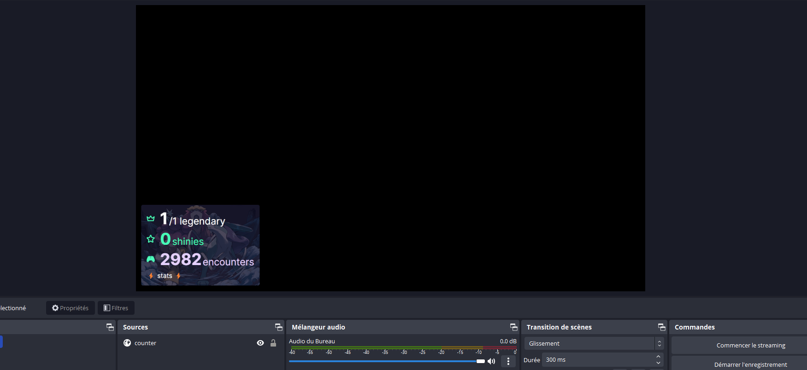
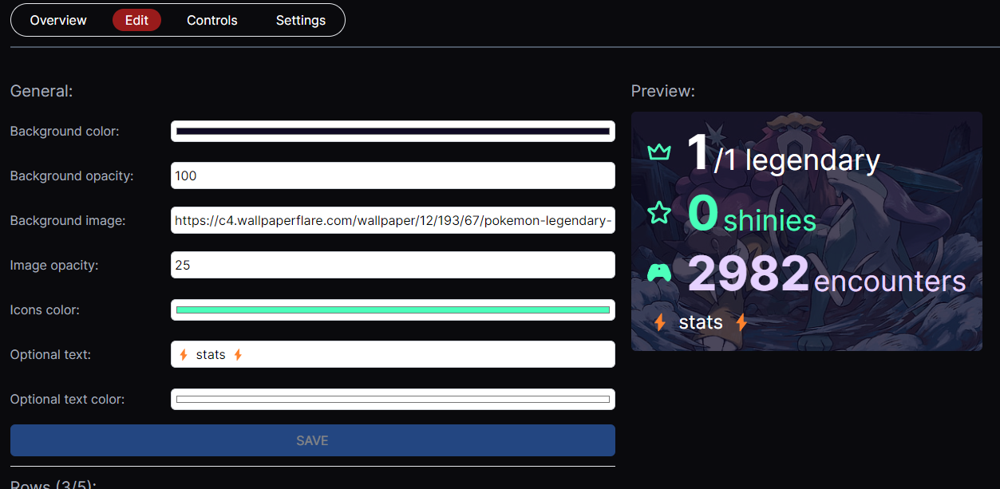

# Counter widgets

  

Users can create, customize and update counters and display them as overlay on OBS or any other streaming software.

It's possible to control it from the web app or via api requests.

  

  
  

## Api requests

It is possible to increment or decrement a row from a counter without using the web app by sending http request.

From the Controls Panels it is possible to directly copy the url related to the row and already including the secret mandatory to update it.

  

An url is composed as:
`HOSTNAME`/api/widgets/counter/`COUNTER_ID`/`ROW_ID`?secret=`SECRET`&type=`TYPE`

Types allowed: `increment`, `decrement`
*note: a row value can be negative*

  

## Live view
Once you've created an customized a counteryou can use it as overlay with realtime changes by symply copying the url provided at the top right corner of the panel.

And in OBS, add a new Web Browser source and paste the url in it.

## Examples

  

Using curl in a terminal, by copying the request of a row:

  

    curl --location --request PATCH 'http://localhost:3000/api/widgets/counter/eee007fa-81f3-4b92-8b00-44d65e017bb7/0d8cf3aa-a8ea-48a5-b072-3c1929b7dcc0?secret=164f3d68-ae4b-40e1-8dd4-ef170bfd1646&type=increment'

  

This request will increment the value related to the row `0d8cf3aa-a8ea-48a5-b072-3c1929b7dcc0` from the counter `eee007fa-81f3-4b92-8b00-4.
